# ForInfo-V1.0 可信赖的桌面助理

## :one: 使用前准备

### 1.  硬件BOM已同步至ForInfo/1.hardware/Bom.list；
### 2.  硬件Gerber文件已同步至ForInfo/1.hardware/gerber,可直接打样（板厚1.2mm）；
### 3.  程序bin文件已同步至ForInfo/2.firmware；
### 4.  3D打印文件已同步至ForInfo/3.STL；
### 5.  ESP32程序下载工具已同步至ForInfo/5.tools；
### 6.  天气城市代码获取流程：
硬件初始化或重置后的流程中，需要在web界面填写天气城市代码以获取对应地区的天气信息，
为方便查询，可登录 [forinfo.org](https://www.forinfo.org) 快速获取，流程如下：

#### **1）登录网站后，等待数据加载完毕；** 
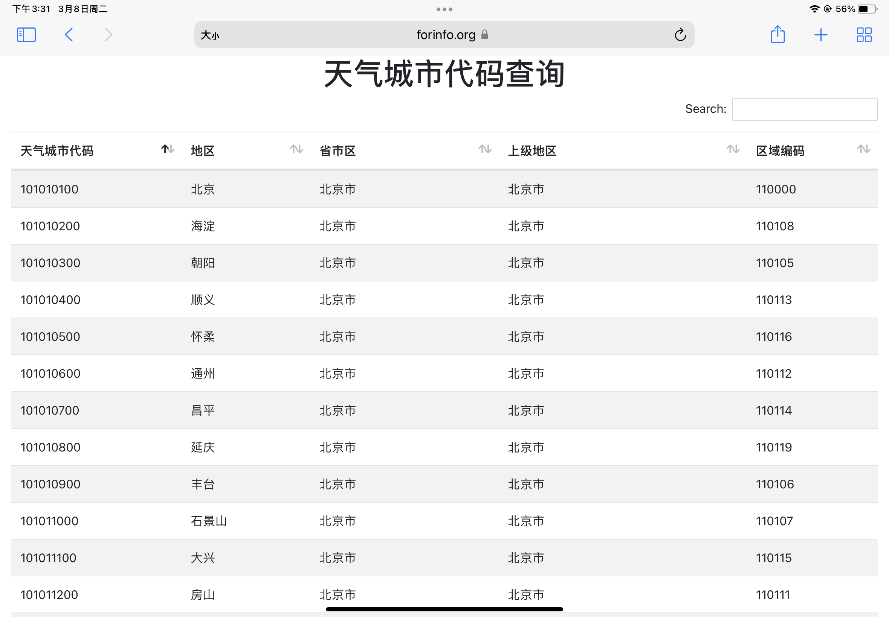
#### **2）在右上角搜索框内，可输入相应地名或区域编码完成搜索；** 
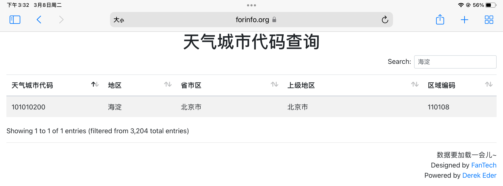
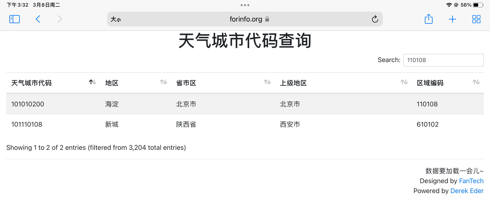
#### **3）获得对应地区的天气城市代码并记录，如北京-海淀地区的天气城市代码为：101010200.** 

## :two: 下载方法
程序烧录过程，可使用 **5.tools** 中的ESP下载工具烧录，可较为方便的完成程序烧录以及后期版本升级等。双击" **flash_download_tools_v3.6.5.exe** "，选择" **ESP32 DownloadTool** ",并按照如下图所示加载4种bin文件，并正确填写后方对应的地址以及勾选下方对应的选项，如下图所示：

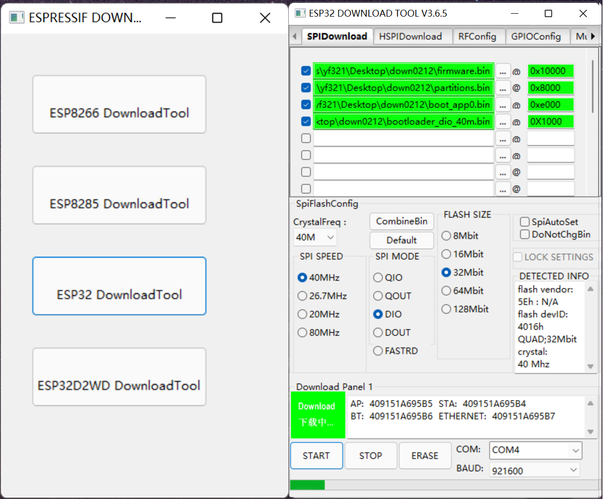

配置好相应选项后，点击 **START** 按钮方可进行下载（后续如遇异常问题，可先点击 **ERASE** 擦除后再点击 **START**）

## :three: 功能介绍

### 1.  配网过程
在系统初始化、重置系统，以及更换路由器或装置被拿到其它地方后，需要重新配置WiFi、天气城市代码、天气刷新时间、自定义字符等信息，此时装置液晶屏幕对应状态如下：

其中，当出现上述几种情况时，界面会处于 **初始化界面** ，屏幕显示装置介绍二维码，可通过扫码了解装置介绍，以及获取 **天气城市代码** 等必要信息；了解了装置设置流程后，可使用移动设备搜索装置WiFi网络（ForInfo），并按照下图配置正确的信息：

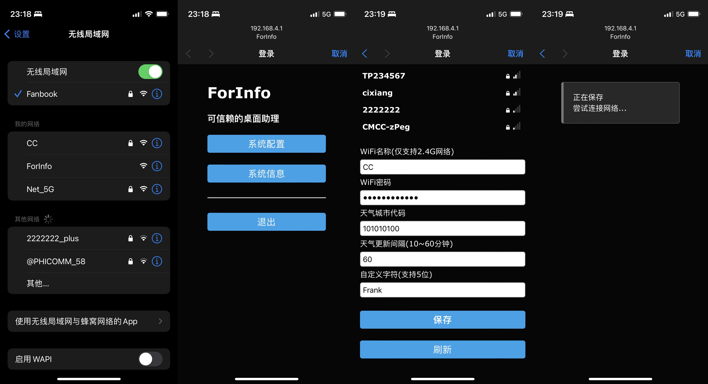

填写完成并保存后，将配置信息传输系统，等待10秒左右，液晶会处于 **配网进程** 界面，等待进度条加载完毕，可开始使用。

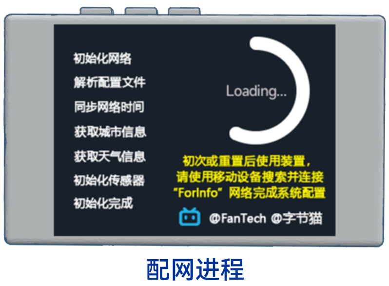

### 2.  功能简介
#### 1）按键功能
整体系统主要包含三个按键，分别为切换页面、屏幕亮度切换（长按重置系统）、重启，如下图所示：
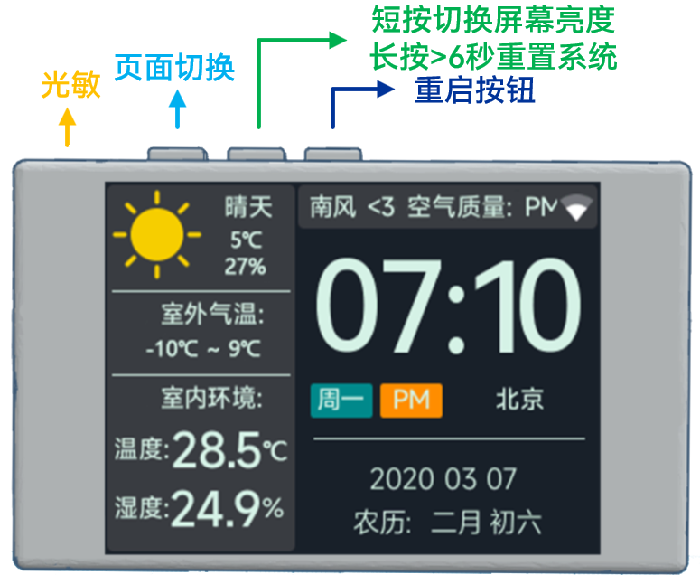
其中，最左侧为光敏电阻，用于自动调节屏幕亮度功能。
#### 2）首页 
首页中，主要包含时钟、星期、年月日、农历、当前室外天气及温湿度、室内温湿度、空气质量、风向以及WiFi信号强度，深色及浅色模式（系统根据当前时间早7-晚7为浅色模式，晚7至次日早7为深色模式，后续不再重复说明），如下所示：
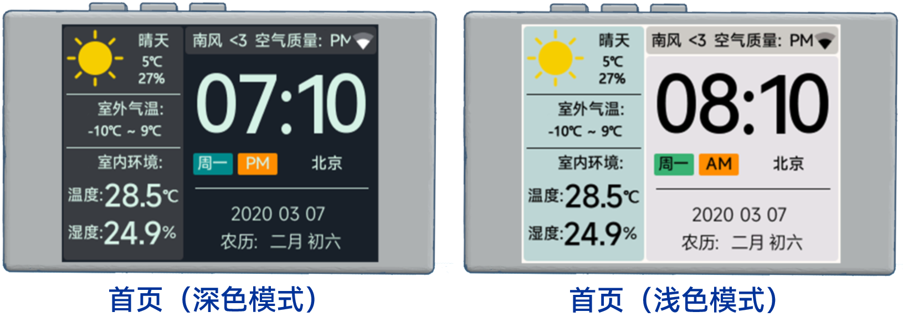
#### 3）关于界面
关于界面中，主要包含当前IP地址、WiFi信号强度、日期、时间、系统版本以及相关资料链接等，深色及浅色模式如下所示：
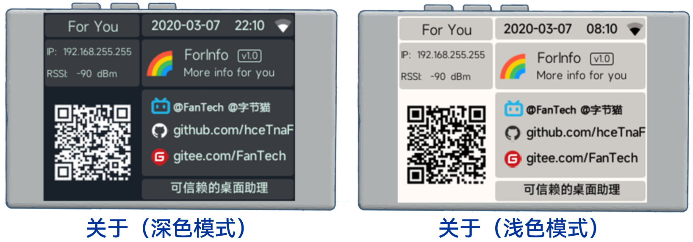
#### 4）简约模式
简约模式界面中，主要包含时钟、日期、星期、当前室外温度信息，如下所示：
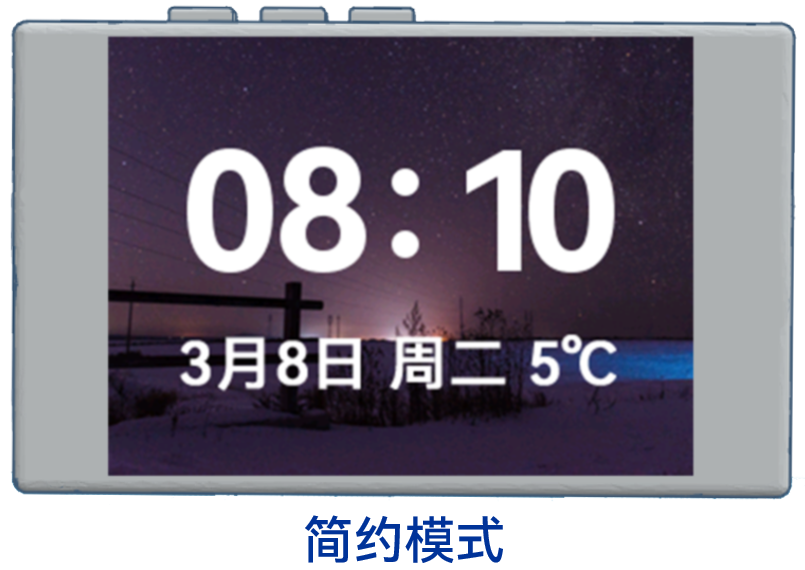
#### 5）亮度调节
装置中间的按键，单次可调节屏幕亮度，分别为：100%、70%、40、10%以及自动调节亮度，如下所示：
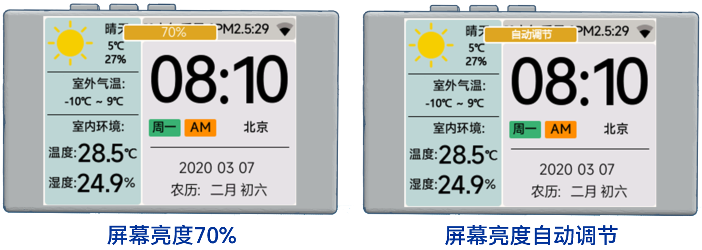
#### 6）系统重置
装置中间的按键， **长按6秒以上** ，屏幕会出现系统开始重置的通知，后续完成系统初始化的操作，如下所示：
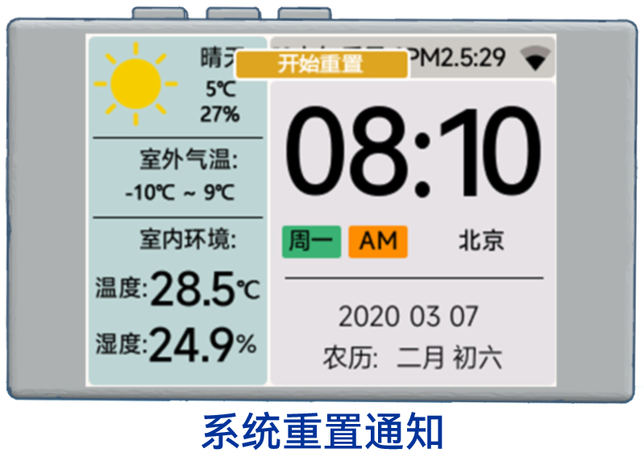
#### 7）版本更新
在关于界面系统版本位置，当检测到系统有更新时，会在版本后显示"new"提示，用户便可以通过下载资料库中最新的bin文件，完成更新下载，如下所示：
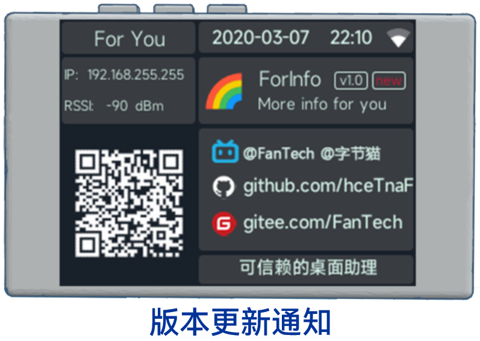
**后续会对固件不断优化更新，请关注B站动态！**

## :four: 注意事项
### 1.  焊接注意
1）光敏电阻距离电路板2mm左右；

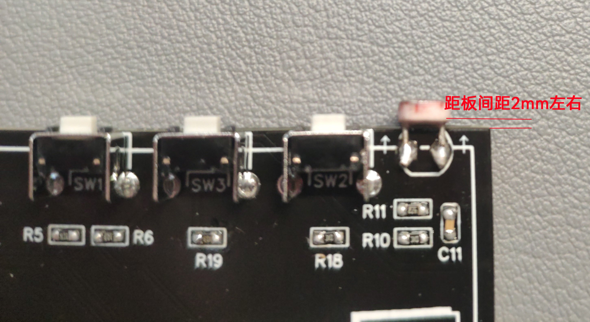

2）注意如CH340C、SHTC3、电源LED（3V3）、二极管的元器件焊接方向；

3）手工焊接先检查电源，再通电开机；

### 2.  装配注意
屏幕左右两侧螺丝为 **M1.6长度4mm** 共2个；底座小板固定及盖板固定为 **M1.6长度5mm** 共8个；
### 3.  使用注意
1）温湿度传感器由于周围板子温度、环境温度干扰与实际室温不相符合，数据仅供参考；

2）根据3D打印材料不同，尽可能避免在高湿高温环境中长时间使用；

3）type-C数据线用于对装置的供电以及程序下载，尽可能选择带有数据功能5V1A以上线材，电源适配器供电电流≥1A；

4）部分使用WEB Portal方式的校园网络无法使用，建议在路由器的WiFi网络环境下使用；

5）该作品仅限用户个人DIY， **禁止个人私自产品化** ，如有问题请在B站私信联系[@FanTech](https://space.bilibili.com/12102785).

## :five: 关于

### 1.  主要贡献：@[FanTech](https://space.bilibili.com/12102785) @[字节猫](https://space.bilibili.com/177322563) 微信公众号：ForInfo
### 2.  壁纸拍摄：(龙镇夜空) @[远山淡影x ](https://space.bilibili.com/378962375)
### 3.  感谢@[Derek Eder](https://github.com/derekeder/csv-to-html-table),[forinfo.org](https://www.forinfo.org)查询网页基于 **Derek Eder** 修改
### 4.  感谢@[tzapu](https://github.com/tzapu/WiFiManager),wifi配置界面基于 **tzapu** 作者汉化及修改
### 5.  项目开发基于[乐鑫ESP32](https://github.com/espressif/arduino-esp32)及[LVGL开源框架](https://github.com/lvgl/lvgl)支持
### 6.  装配视频在bilibili：@[FanTech](https://space.bilibili.com/12102785)
### 7.  gitee地址：[https://gitee.com/FanTech](https://gitee.com/FanTech)

欢迎star :)
